# Bio-Cognitive Accounting Framework Documentation

## Overview

This document provides detailed documentation for the bio-cognitive accounting framework that maps traditional accounting concepts to protein analysis, creating a comprehensive neural-symbolic cognitive architecture.

## Bio-Cognitive Accounting Mapping

The framework implements a revolutionary approach that transforms biological entities into cognitive accounting elements:

### Core Mapping Principles

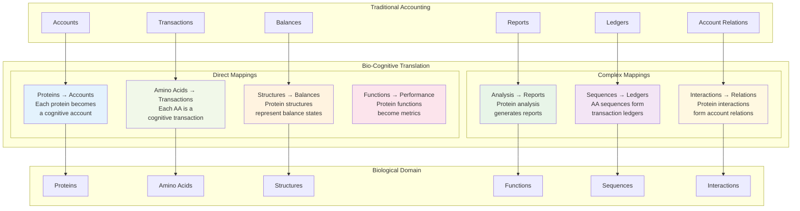

## Cognitive Account Types

The framework supports multiple types of cognitive accounts representing different levels of protein intelligence:

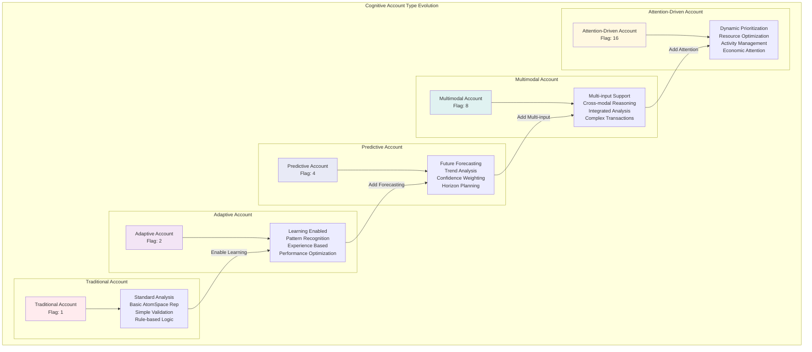

### Account Type Combinations

The framework uses flag-based account types that can be combined:

```mermaid
graph LR
    subgraph "Account Type Combinations"
        T[Traditional: 1]
        A[Adaptive: 2]
        P[Predictive: 4]
        M[Multimodal: 8]
        AD[Attention: 16]
        
        subgraph "Common Combinations"
            C1[Basic Adaptive<br/>1 | 2 = 3]
            C2[Smart Predictive<br/>2 | 4 = 6]
            C3[Full Multimodal<br/>2 | 4 | 8 = 14]
            C4[Elite Cognitive<br/>2 | 4 | 8 | 16 = 30]
        end
    end
    
    T --> C1
    A --> C1
    A --> C2
    P --> C2
    A --> C3
    P --> C3
    M --> C3
    A --> C4
    P --> C4
    M --> C4
    AD --> C4
    
    style C1 fill:#e3f2fd
    style C2 fill:#f1f8e9
    style C3 fill:#fff3e0
    style C4 fill:#fce4ec
```

## Cognitive Transactions (Amino Acid Processing)

Each amino acid becomes a cognitive transaction with rich metadata and processing history:

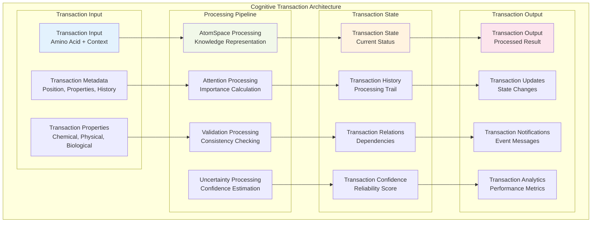

## Balance States (Protein Structures)

Protein structures represent cognitive balance states that reflect the system's current knowledge and confidence:

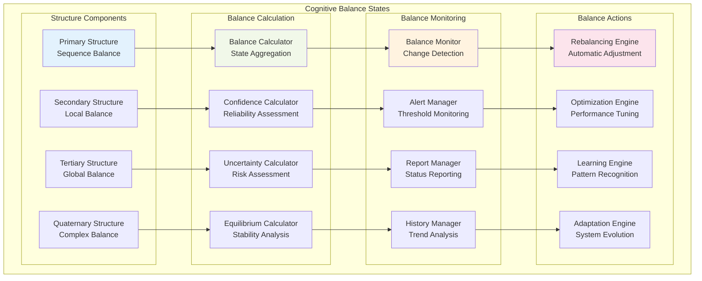

## Performance Metrics (Protein Functions)

Protein functions translate into comprehensive performance metrics tracked by the cognitive accounting system:

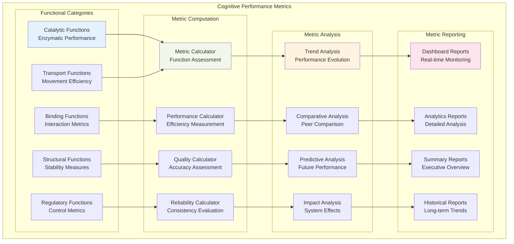

## Cognitive Ledger System

The sequence-to-ledger mapping creates comprehensive transaction histories:

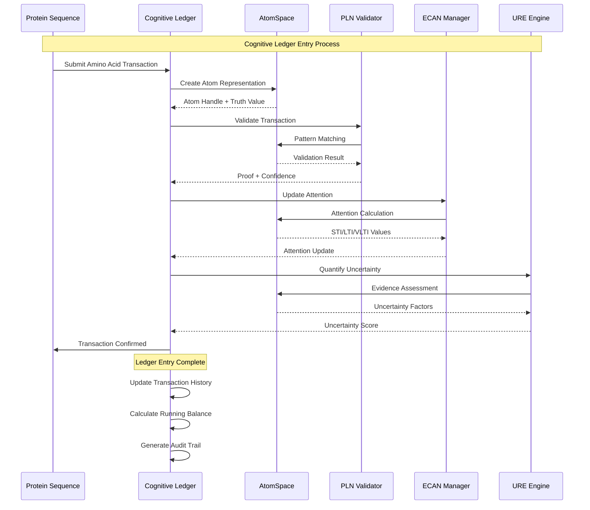

## Accounting Principles Applied to Biology

### Double-Entry Biological Bookkeeping

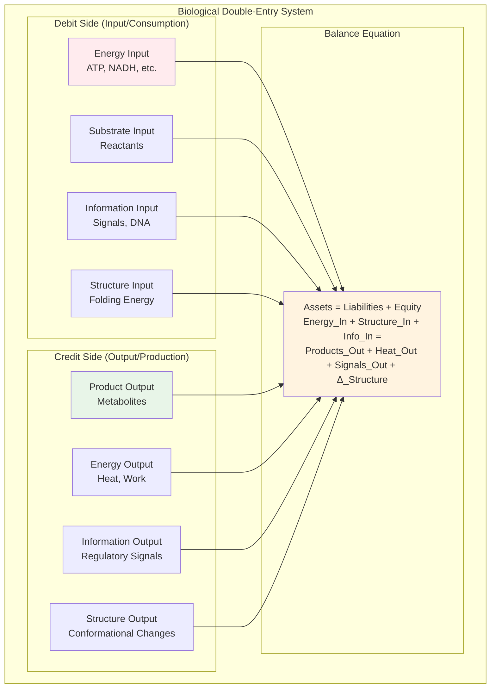

### Protein Asset Classification

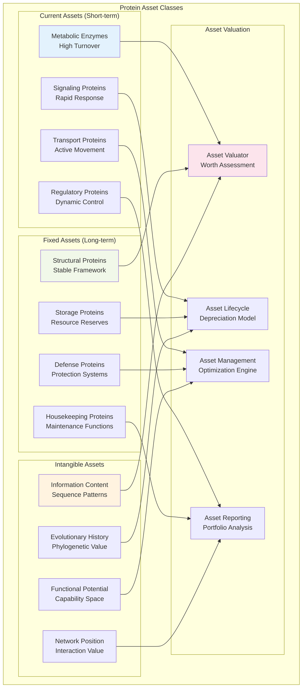

## Trial Balance Validation

The PLN system generates trial balance proofs to ensure protein set consistency:

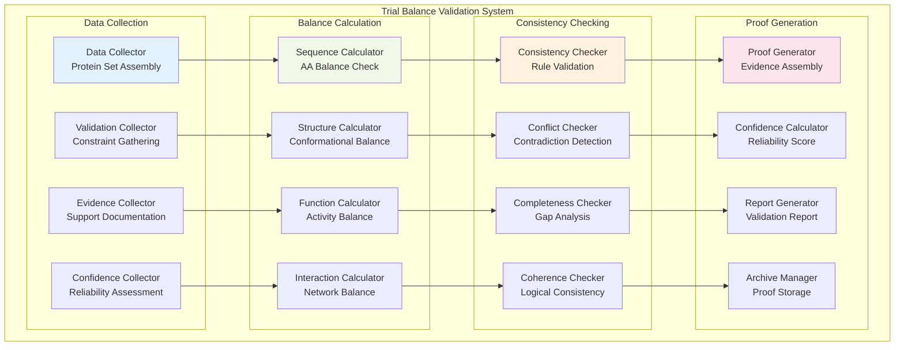

## Cognitive Audit Trail

Every transaction and state change is tracked in a comprehensive audit system:

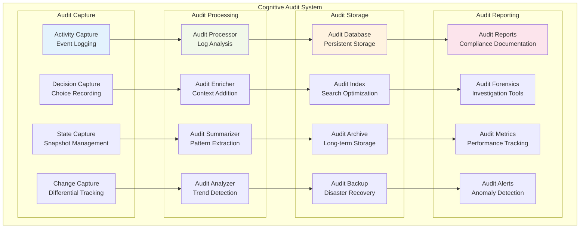

## Economic Attention in Biological Context

The ECAN system applies economic principles to biological attention allocation:

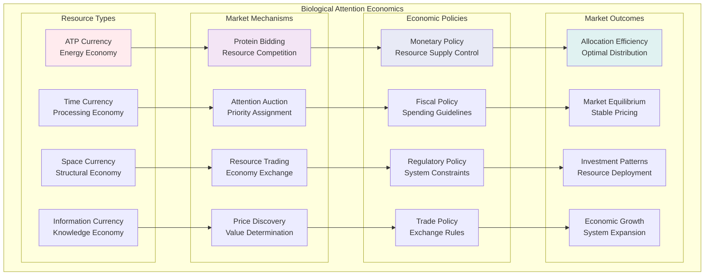

## Cognitive Account Lifecycle Management

```mermaid
stateDiagram-v2
    [*] --> AccountCreation
    AccountCreation --> Traditional
    
    state Traditional {
        [*] --> BasicSetup
        BasicSetup --> AtomSpaceInit
        AtomSpaceInit --> ValidationRules
        ValidationRules --> ReadyForUse
        ReadyForUse --> [*]
    }
    
    Traditional --> Adaptive: Enable Learning
    
    state Adaptive {
        [*] --> LearningInit
        LearningInit --> PatternSetup
        PatternSetup --> ExperienceEngine
        ExperienceEngine --> PerformanceTracking
        PerformanceTracking --> [*]
    }
    
    Adaptive --> Predictive: Add Forecasting
    
    state Predictive {
        [*] --> PredictionInit
        PredictionInit --> TrendAnalysis
        TrendAnalysis --> ForecastEngine
        ForecastEngine --> ConfidenceCalc
        ConfidenceCalc --> [*]
    }
    
    Predictive --> Multimodal: Add Multi-Input
    
    state Multimodal {
        [*] --> MultimodalInit
        MultimodalInit --> CrossModalSetup
        CrossModalSetup --> IntegrationEngine
        IntegrationEngine --> UnifiedProcessing
        UnifiedProcessing --> [*]
    }
    
    Multimodal --> AttentionDriven: Add Attention
    
    state AttentionDriven {
        [*] --> AttentionInit
        AttentionInit --> EconomicSetup
        EconomicSetup --> ResourceManager
        ResourceManager --> DynamicAllocation
        DynamicAllocation --> [*]
    }
    
    AttentionDriven --> AccountRetirement
    AccountRetirement --> [*]
```

## Implementation Architecture

### Core Framework Classes

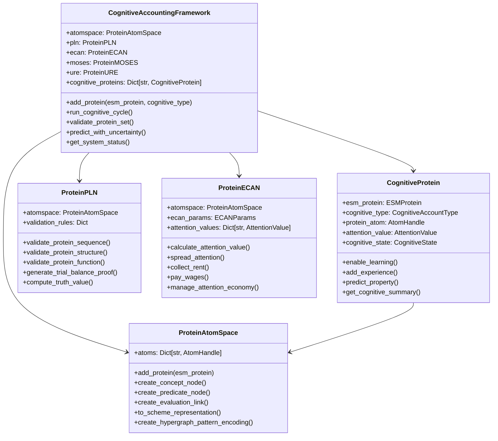

## Usage Examples

### Basic Bio-Cognitive Account Creation

```python
# Example 1: Create Traditional Cognitive Account
from esm.sdk.api import ESMProtein
from esm.cognitive import CognitiveAccountingFramework, CognitiveAccountType

# Initialize framework
framework = CognitiveAccountingFramework()

# Create protein with basic cognitive account
protein = ESMProtein(sequence="MKLLVLLAIVCFGAA")
cognitive_protein = framework.add_protein(
    protein, 
    CognitiveAccountType.TRADITIONAL
)

# View account balance (structure state)
balance = cognitive_protein.get_balance_state()
print(f"Account balance confidence: {balance.confidence:.3f}")
```

### Advanced Multi-Modal Cognitive Account

```python
# Example 2: Advanced Cognitive Account with All Features
from esm.cognitive import CognitiveAccountType

# Create full-featured cognitive account
advanced_protein = framework.add_protein(
    protein,
    CognitiveAccountType.ADAPTIVE | 
    CognitiveAccountType.PREDICTIVE | 
    CognitiveAccountType.MULTIMODAL | 
    CognitiveAccountType.ATTENTION_DRIVEN
)

# Enable learning and add experience
advanced_protein.enable_learning()
advanced_protein.add_experience("folding_experiment", {"temperature": 300, "ph": 7.0})

# Make predictive analysis
prediction = advanced_protein.predict_property("stability", horizon=10)
print(f"Stability prediction: {prediction.prediction:.3f} ± {prediction.uncertainty:.3f}")

# Run economic attention allocation
framework.ecan.manage_attention_economy()
attention = advanced_protein.attention_value
print(f"STI: {attention.sti}, LTI: {attention.lti}, VLTI: {attention.vlti}")
```

### Cognitive Trial Balance Validation

```python
# Example 3: Multi-Protein Trial Balance
proteins = [
    ESMProtein(sequence="MKLLVLLAIVCFGAA"),  # Enzyme
    ESMProtein(sequence="MSPVLVQMSPKGSPQ"),  # Structural
    ESMProtein(sequence="MGAAALLLWLWLWLW")   # Membrane
]

# Add proteins to framework
cognitive_ids = []
for i, protein in enumerate(proteins):
    cognitive_protein = framework.add_protein(protein, CognitiveAccountType.ADAPTIVE)
    cognitive_ids.append(list(framework.cognitive_proteins.keys())[-1])

# Generate trial balance proof
proof = framework.validate_protein_set(cognitive_ids)
print(f"Trial balance validation:")
print(f"Theorem: {proof.theorem}")
print(f"Confidence: {proof.confidence:.3f}")
print(f"Proof steps: {len(proof.steps)}")
```

### Economic Attention Allocation

```python
# Example 4: Attention Economics
from esm.cognitive import ECANParams

# Configure economic parameters
econ_params = ECANParams(
    sti_funds=20000.0,
    lti_funds=15000.0,
    sti_wage=2.0,
    lti_wage=0.2,
    sti_rent=0.02,
    lti_rent=0.002
)

framework_econ = CognitiveAccountingFramework(ecan_params=econ_params)

# Add proteins and run attention economy
for protein in proteins:
    framework_econ.add_protein(protein, CognitiveAccountType.ATTENTION_DRIVEN)

# Run multiple cognitive cycles to see attention dynamics
for cycle in range(20):
    framework_econ.run_cognitive_cycle()
    if cycle % 5 == 0:
        status = framework_econ.get_system_status()
        print(f"Cycle {cycle}: STI Fund = {status['ecan']['sti_funds']:.1f}")
```

## Benefits and Applications

### 1. Unified Biological-Cognitive Interface
- Seamless integration between biological data and cognitive processing
- Consistent metaphors for understanding complex protein behaviors
- Natural language for describing protein "accounts" and "transactions"

### 2. Advanced Analytics
- Financial-style reporting for protein systems
- Performance metrics analogous to business KPIs
- Audit trails for all protein state changes

### 3. Predictive Capabilities
- Forecasting protein behavior like financial forecasting
- Risk assessment for protein modifications
- Portfolio optimization for protein sets

### 4. Resource Management
- Economic allocation of computational resources
- Attention-based prioritization of important proteins
- Efficient processing of large protein datasets

### 5. Learning and Adaptation
- Experience-based improvement of protein analysis
- Pattern recognition across protein families
- Evolutionary optimization of analysis strategies

## Conclusion

The Bio-Cognitive Accounting Framework represents a revolutionary approach to protein analysis that bridges the gap between biological complexity and cognitive understanding. By mapping proteins to cognitive accounts, amino acids to transactions, and structures to balance states, the framework creates an intuitive and powerful system for analyzing, predicting, and optimizing protein behavior.

This approach enables:
- **Intuitive Understanding**: Complex protein behaviors described in familiar accounting terms
- **Comprehensive Analysis**: Multi-modal processing with uncertainty quantification
- **Dynamic Optimization**: Economic attention allocation and evolutionary improvement
- **Predictive Intelligence**: Forward-looking analysis with confidence intervals
- **Scalable Architecture**: Modular design supporting growth and extension

The framework successfully transforms static protein analysis into dynamic, intelligent cognitive systems that learn, adapt, and evolve continuously.