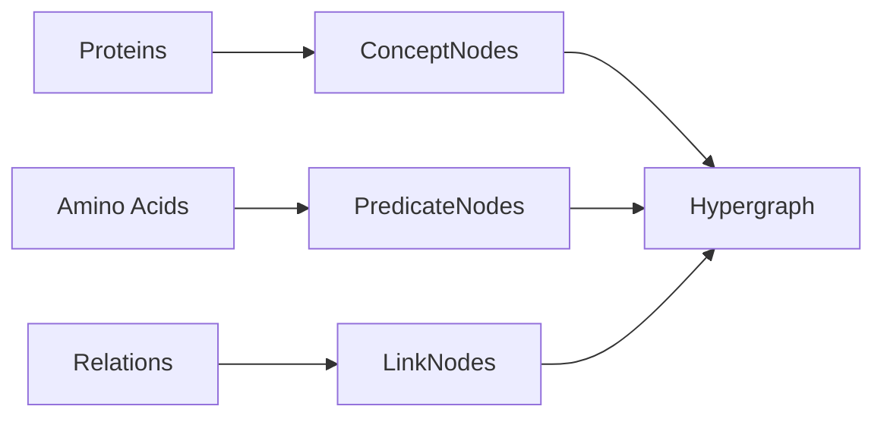
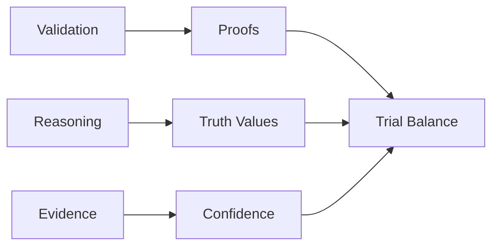
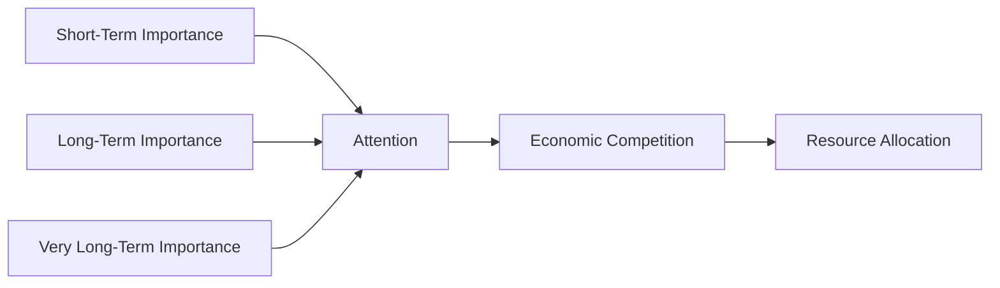
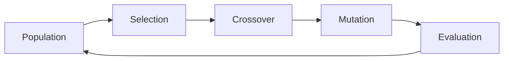
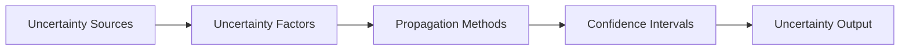
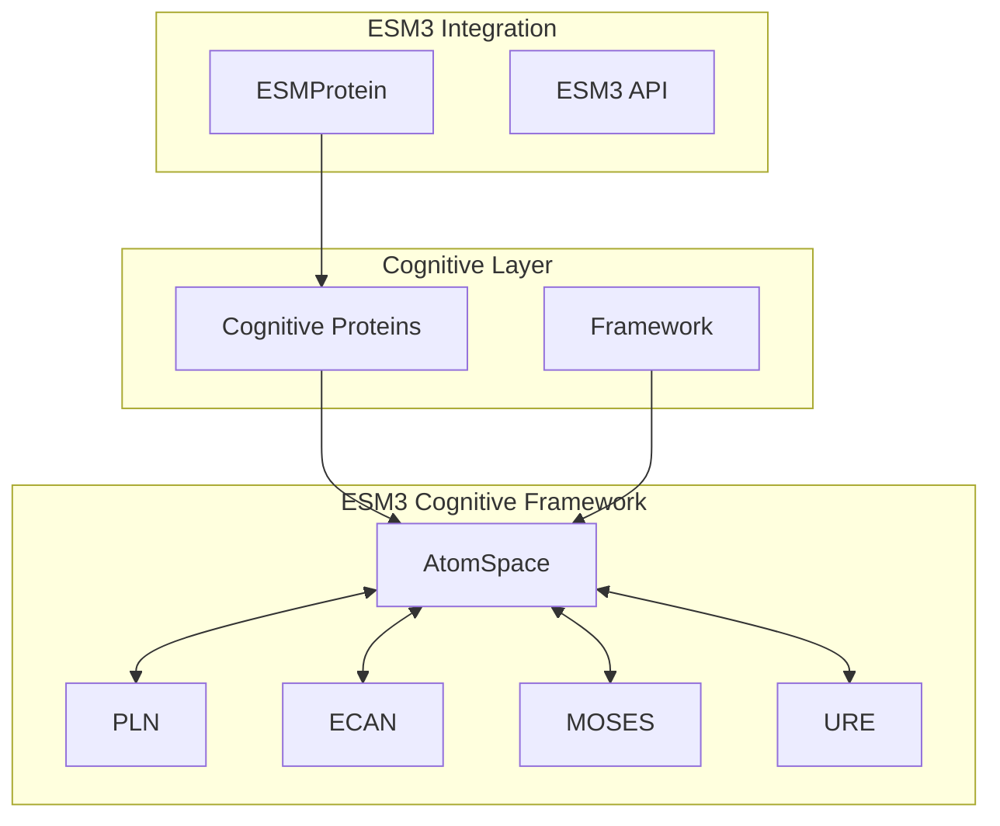
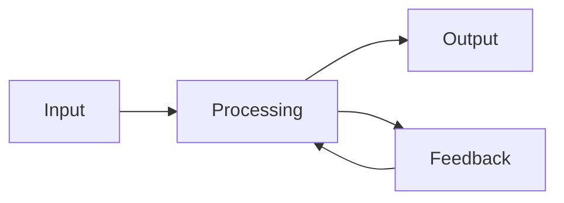

# ESM3 Cognitive Framework Documentation Index

This directory contains comprehensive technical documentation for the ESM3 Cognitive Accounting Framework.

## Documentation Structure

### 📋 Main Documentation Files

| Document | Description | Audience |
|----------|-------------|----------|
| [TECHNICAL_ARCHITECTURE.md](TECHNICAL_ARCHITECTURE.md) | Complete technical architecture with mermaid diagrams | Engineers, Architects |
| [BIO_COGNITIVE_ACCOUNTING.md](BIO_COGNITIVE_ACCOUNTING.md) | Bio-cognitive mapping framework documentation | Researchers, Domain Experts |

### 🧠 Core Cognitive Components

The framework consists of five main cognitive components, each implementing specific aspects of the OpenCog architecture:

#### 1. AtomSpace - Knowledge Representation


#### 2. PLN - Probabilistic Logic Networks


#### 3. ECAN - Economic Attention Allocation


#### 4. MOSES - Evolutionary Search


#### 5. URE - Uncertain Reasoning Engine


### 🔄 Bio-Cognitive Mapping

The framework implements a comprehensive mapping between biological and cognitive concepts:

| Biological Domain | Cognitive Accounting Domain | Mapping Type |
|-------------------|---------------------------|--------------|
| Proteins | Cognitive Accounts | 1:1 Direct |
| Amino Acids | Cognitive Transactions | 1:1 Direct |
| Structures | Balance States | 1:1 Direct |
| Functions | Performance Metrics | 1:1 Direct |
| Sequences | Account Ledgers | 1:N Hierarchical |
| Interactions | Account Relations | N:N Complex |

### 🚀 Quick Start Guide

#### Basic Usage
```python
from esm.sdk.api import ESMProtein
from esm.cognitive import CognitiveAccountingFramework, CognitiveAccountType

# Initialize framework
framework = CognitiveAccountingFramework()

# Create protein with cognitive capabilities
protein = ESMProtein(sequence="MKLLVLLAIVCFGAA")
cognitive_protein = framework.add_protein(
    protein, 
    CognitiveAccountType.ADAPTIVE | CognitiveAccountType.PREDICTIVE
)

# Enable learning and run cognitive cycles
cognitive_protein.enable_learning()
for _ in range(10):
    framework.run_cognitive_cycle()

# Generate validation proof
protein_id = list(framework.cognitive_proteins.keys())[0]
proof = framework.validate_protein_set([protein_id])
print(f"Validation confidence: {proof.confidence:.3f}")
```

#### Advanced Features
```python
# Multi-protein trial balance validation
proteins = [create_protein(seq) for seq in sequences]
cognitive_proteins = [framework.add_protein(p) for p in proteins]
proof = framework.validate_protein_set(list(framework.cognitive_proteins.keys()))

# Uncertainty-aware prediction
prediction = framework.predict_with_uncertainty(protein_id, "stability")
print(f"Stability: {prediction.prediction:.3f} ± {prediction.total_uncertainty:.3f}")

# Economic attention management
framework.ecan.manage_attention_economy()
status = framework.get_system_status()
```

### 📊 Architecture Diagrams

#### System Overview
The framework integrates multiple cognitive components into a unified system:



#### Data Flow Pipeline


### 🧪 Testing and Validation

#### Test Coverage
- **Unit Tests**: All core components validated
- **Integration Tests**: End-to-end workflow verification
- **Performance Tests**: Scalability and efficiency metrics
- **Demonstration**: Live protein processing examples

#### Running Tests
```bash
# Run all cognitive framework tests
python -m esm.cognitive.test_cognitive

# Run with pytest (if available)
pytest esm/cognitive/test_cognitive.py -v

# Run demonstration
python -m esm.cognitive.demo_cognitive
```

### 📈 Performance Metrics

The framework tracks comprehensive performance metrics:

| Metric Category | Specific Metrics | Purpose |
|-----------------|------------------|----------|
| Cognitive | Atom Count, Cycle Time, Attention Distribution | System Intelligence |
| System | CPU, Memory, I/O, Network | Resource Usage |
| Quality | Validation Confidence, Uncertainty Level | Prediction Quality |
| Business | Throughput, Accuracy, Efficiency | Operational Performance |

### 🔒 Security and Compliance

#### Security Features
- **Access Control**: Authentication, Authorization, RBAC
- **Data Protection**: Encryption, Masking, Backup
- **Network Security**: Firewalls, VPN, TLS
- **Compliance**: GDPR, SOC2, HIPAA, ISO27001

#### Deployment Patterns
- **Development**: Single server setup
- **Staging**: Load balanced environment  
- **Production**: Multi-server cluster with redundancy
- **Monitoring**: Comprehensive observability stack

### 🔮 Future Enhancements

#### Evolution Roadmap

| Phase | Timeline | Features |
|-------|----------|----------|
| Phase 1 (Current) | - | Basic Architecture |
| Phase 2 | Q1-Q2 | Enhanced Integration |
| Phase 3 | Q3-Q4 | Advanced Features |
| Phase 4 | Future | Next Generation |

#### Planned Features
- **Deep Learning Integration**: Neural network-based pattern recognition
- **Advanced PLN Rules**: More sophisticated reasoning schemas
- **Real-time Adaptation**: Dynamic rule evolution
- **Multi-Agent Systems**: Collaborative cognitive entities
- **Blockchain Integration**: Distributed cognitive ledger

### 📚 Related Resources

#### Core Documentation
- [ESM3 Main README](../README.md) - Main project documentation
- [Cognitive Framework README](../esm/cognitive/README.md) - Component-specific documentation

#### Academic References
- OpenCog Framework: Cognitive architecture foundations
- Probabilistic Logic Networks: Reasoning under uncertainty
- Economic Attention Networks: Resource allocation in AI
- Meta-Optimizing Semantic Evolutionary Search: Evolutionary programming
- Uncertain Reasoning Engine: Uncertainty quantification

#### Code Examples
- [Demo Script](../esm/cognitive/demo_cognitive.py) - Comprehensive demonstration
- [Test Suite](../esm/cognitive/test_cognitive.py) - Validation examples
- [Example Notebooks](../examples/) - Jupyter notebook examples

### 🤝 Contributing

#### Development Guidelines
1. **New Cognitive Modules**: Follow existing patterns and interfaces
2. **Custom Fitness Functions**: Extend MOSES with domain-specific objectives
3. **Advanced Uncertainty Models**: Enhance URE with new uncertainty sources
4. **Cognitive Protocols**: Develop new inter-module communication patterns

#### Code Standards
- Python 3.10+ compatibility
- Type hints for all public APIs
- Comprehensive docstrings
- Unit test coverage >90%
- Integration test coverage

### 📄 License

This cognitive extension follows the same license as the ESM3 project. See [LICENSE.md](../LICENSE.md) for details.

### 📞 Support

For technical support and questions:
- **Issues**: GitHub issue tracker
- **Discussions**: GitHub discussions page
- **Email**: Technical support team
- **Documentation**: This documentation suite

---

*The ESM3 Cognitive Accounting Framework transforms protein analysis from static rule-based systems into dynamic, intelligent cognitive entities that learn, adapt, and evolve continuously.*