# ESM3 Cognitive Accounting Framework - Technical Architecture

## Overview

This document provides comprehensive technical architecture documentation for the ESM3 Cognitive Accounting Framework, a neural-symbolic cognitive system that transforms protein analysis into intelligent cognitive accounting.

## Table of Contents

1. [System Architecture Overview](#system-architecture-overview)
2. [Bio-Cognitive Mapping](#bio-cognitive-mapping)
3. [Core Components Architecture](#core-components-architecture)
4. [Data Flow Architecture](#data-flow-architecture)
5. [Cognitive Processing Cycles](#cognitive-processing-cycles)
6. [Inter-Module Communication](#inter-module-communication)
7. [Attention Economics Model](#attention-economics-model)
8. [Uncertainty Propagation](#uncertainty-propagation)
9. [Evolutionary Optimization Pipeline](#evolutionary-optimization-pipeline)
10. [Integration Patterns](#integration-patterns)

## System Architecture Overview

The ESM3 Cognitive Accounting Framework implements a comprehensive neural-symbolic architecture that maps biological protein analysis to cognitive accounting principles.

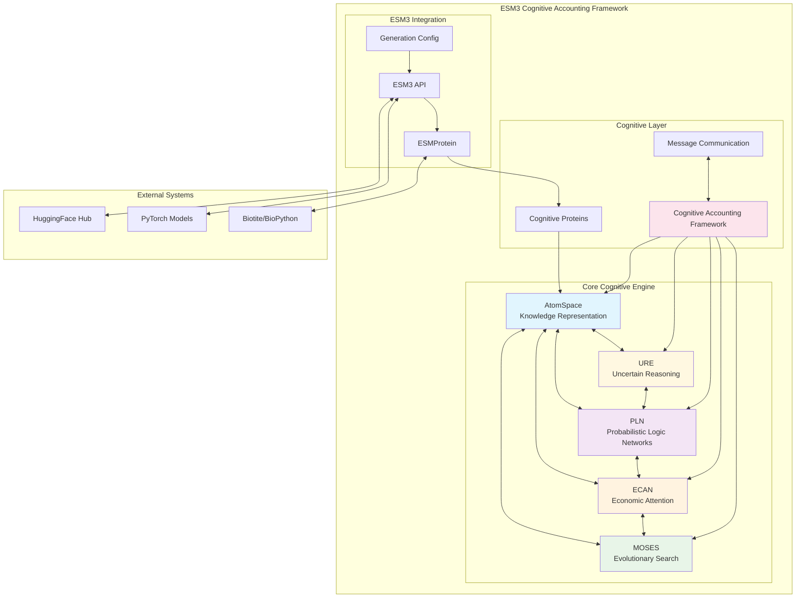

## Bio-Cognitive Mapping

The framework implements a comprehensive mapping between biological and cognitive concepts:

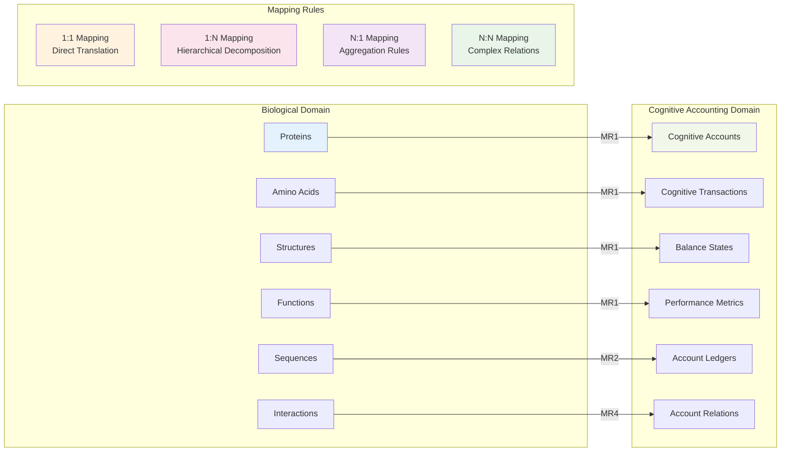

## Core Components Architecture

### AtomSpace Knowledge Representation

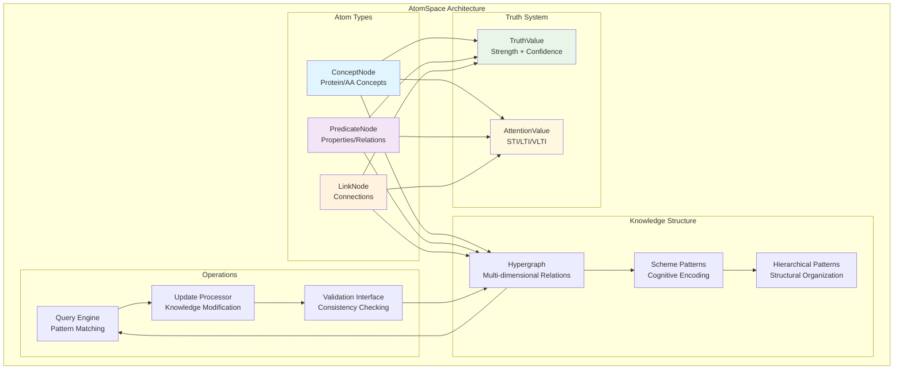

### PLN Reasoning Architecture

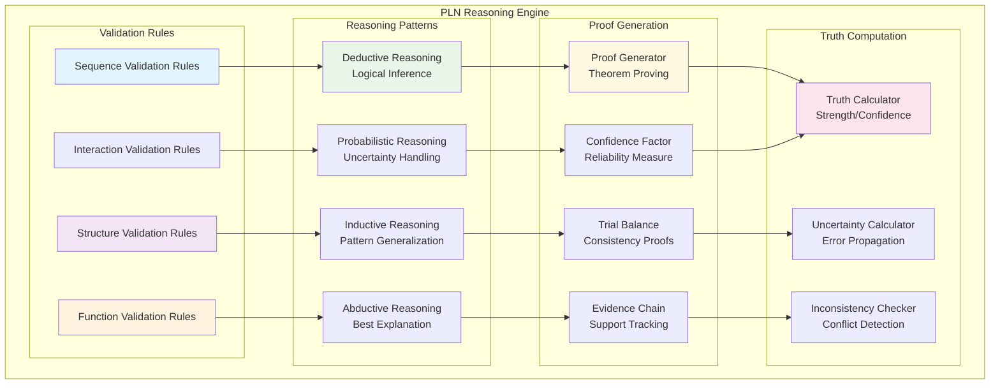

### ECAN Attention Architecture

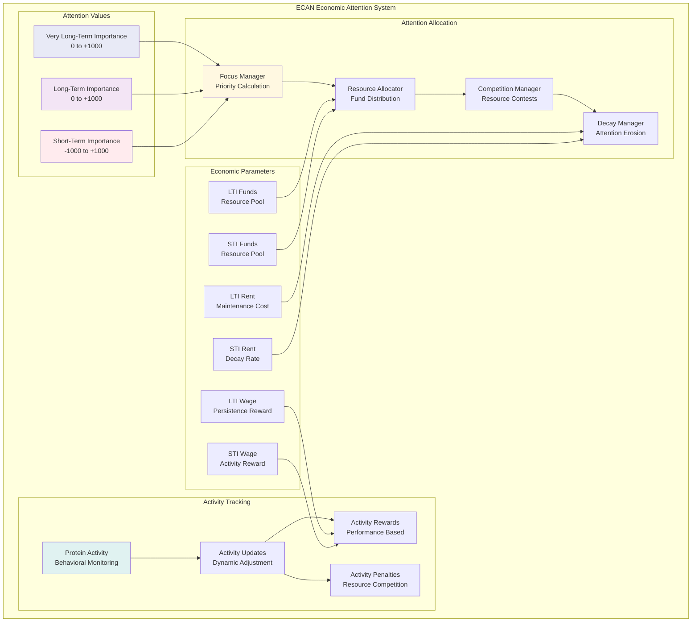

## Data Flow Architecture

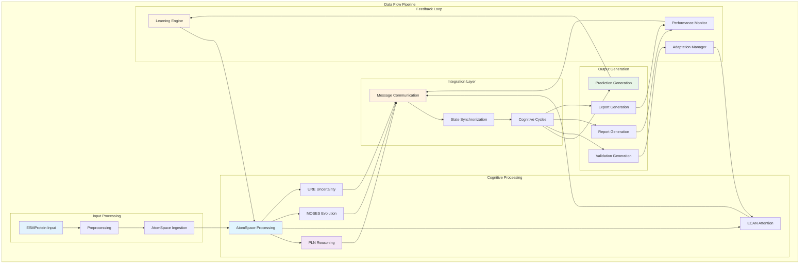

## Cognitive Processing Cycles

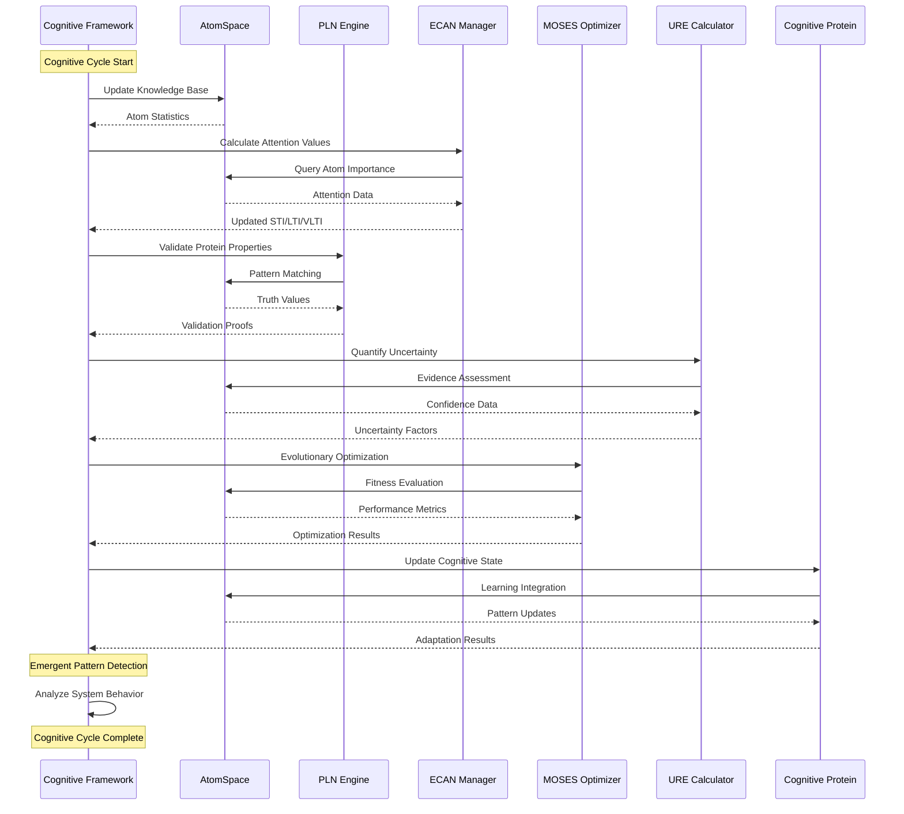

## Inter-Module Communication

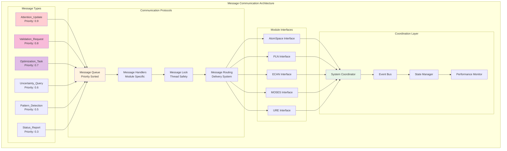

## Attention Economics Model

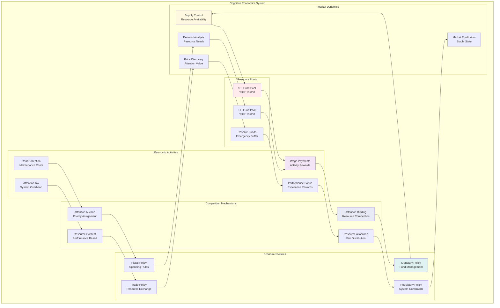

## Uncertainty Propagation

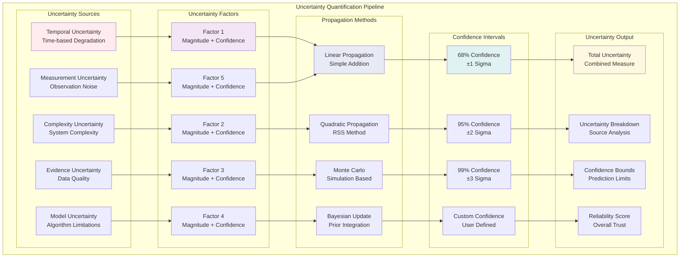

## Evolutionary Optimization Pipeline

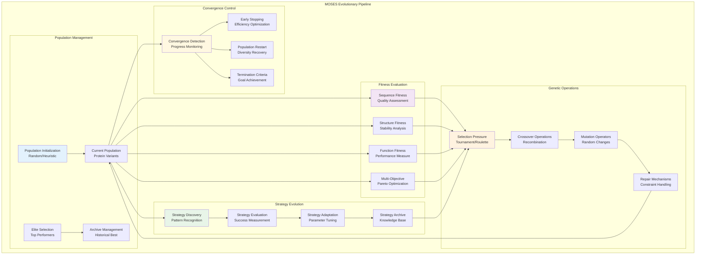

## Integration Patterns

### Cognitive Protein Lifecycle

```mermaid
stateDiagram-v2
    [*] --> Traditional
    Traditional --> Adaptive: Enable Learning
    Adaptive --> Predictive: Add Forecasting
    Predictive --> Multimodal: Add Multi-input
    Multimodal --> AttentionDriven: Add Attention
    
    state Traditional {
        [*] --> BasicProcessing
        BasicProcessing --> AtomSpaceRep
        AtomSpaceRep --> SimpleValidation
        SimpleValidation --> [*]
    }
    
    state Adaptive {
        [*] --> LearningEnabled
        LearningEnabled --> PatternRecognition
        PatternRecognition --> ExperienceAccumulation
        ExperienceAccumulation --> PerformanceOptimization
        PerformanceOptimization --> [*]
    }
    
    state Predictive {
        [*] --> ForecastingEnabled
        ForecastingEnabled --> TrendAnalysis
        TrendAnalysis --> FutureProjection
        FutureProjection --> ConfidenceWeighting
        ConfidenceWeighting --> [*]
    }
    
    state Multimodal {
        [*] --> MultiInputSupport
        MultiInputSupport --> CrossModalReasoning
        CrossModalReasoning --> IntegratedAnalysis
        IntegratedAnalysis --> [*]
    }
    
    state AttentionDriven {
        [*] --> DynamicPrioritization
        DynamicPrioritization --> ResourceOptimization
        ResourceOptimization --> ActivityManagement
        ActivityManagement --> [*]
    }
```

### System Integration Architecture

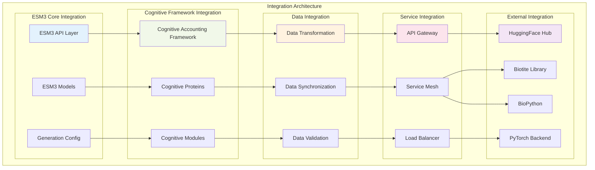

## Performance and Scalability

### Performance Metrics Architecture

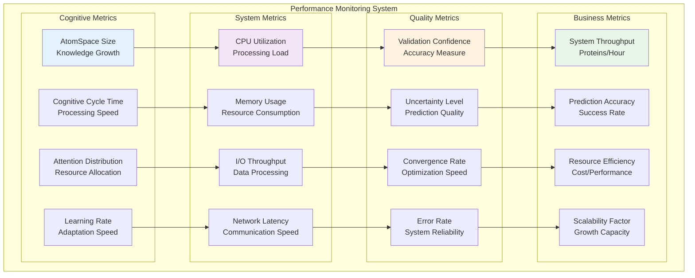

## Security and Compliance

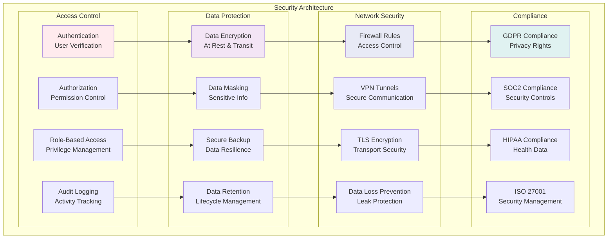

## Deployment Architecture

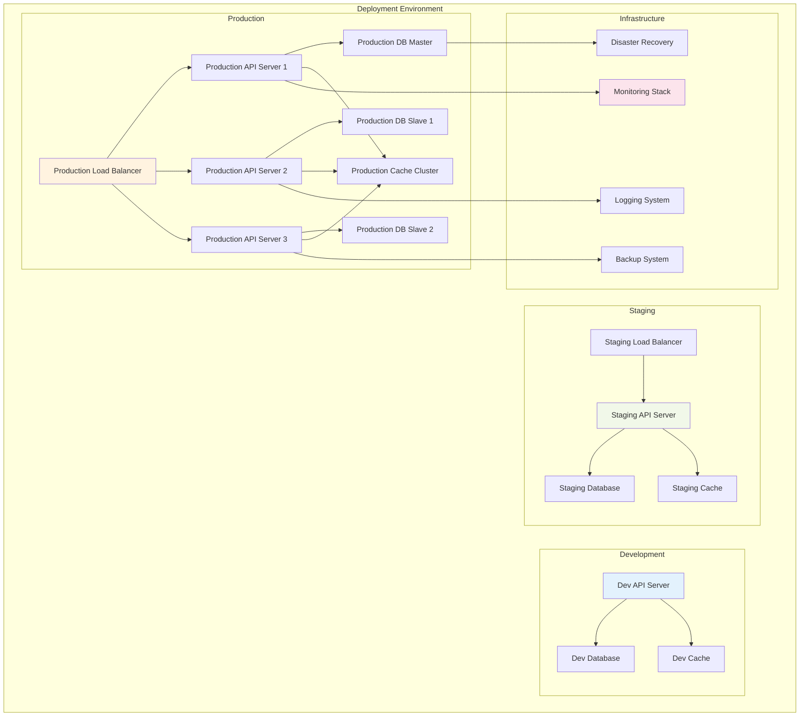

## Future Architecture Considerations

### Evolution Roadmap

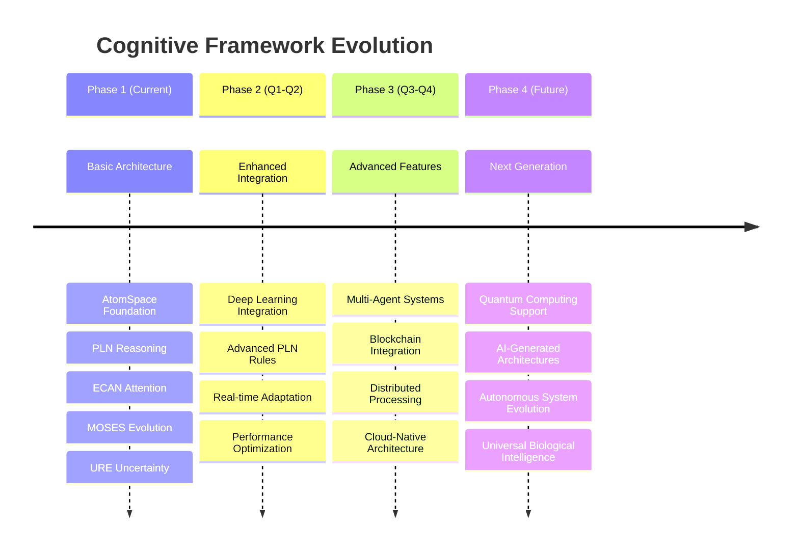

### Scalability Patterns

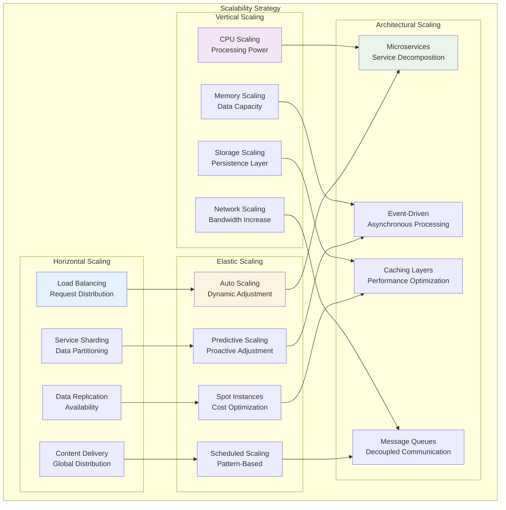

## Conclusion

The ESM3 Cognitive Accounting Framework represents a paradigm shift in protein analysis, transforming static rule-based systems into dynamic, intelligent cognitive entities. This architecture provides:

1. **Comprehensive Knowledge Representation**: Hypergraph-based modeling of biological knowledge
2. **Intelligent Reasoning**: Probabilistic logic for handling uncertainty in biological data
3. **Dynamic Resource Management**: Economic attention allocation for optimal performance
4. **Evolutionary Optimization**: Continuous improvement through genetic algorithms
5. **Uncertainty Quantification**: Robust handling of incomplete information
6. **Scalable Integration**: Modular architecture supporting growth and extension

The framework successfully bridges cognitive computing principles with computational biology, creating a foundation for next-generation protein analysis systems that learn, adapt, and evolve continuously.